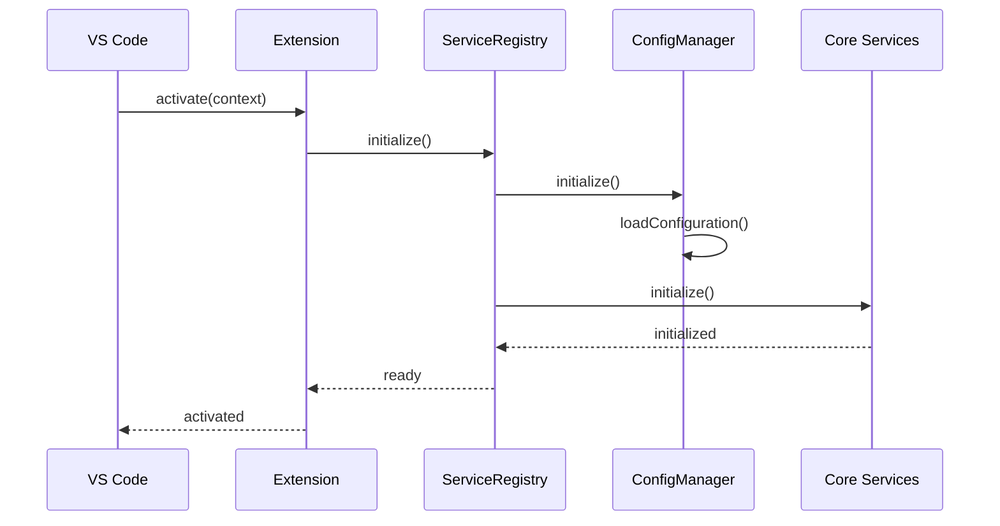
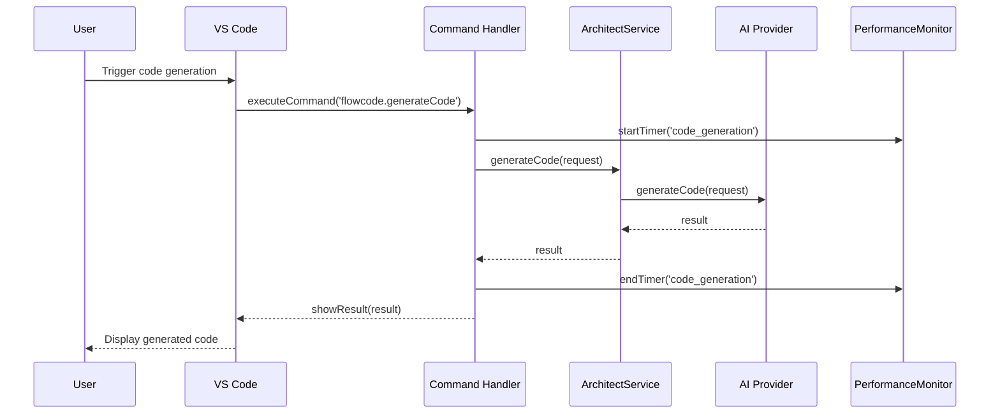
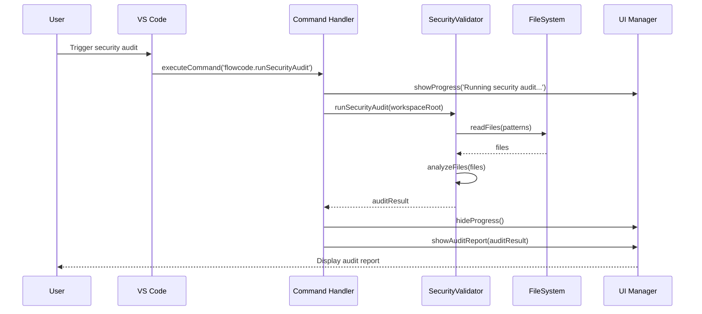

# FlowCode Architecture Overview

This document provides a comprehensive overview of FlowCode's architecture, design patterns, and component interactions.

## System Architecture

FlowCode follows a modular, service-oriented architecture with clear separation of concerns:

```
┌─────────────────────────────────────────────────────────────────┐
│                      VS Code Extension Host                     │
└───────────────────────────────┬─────────────────────────────────┘
                                │
┌───────────────────────────────▼─────────────────────────────────┐
│                        Extension Entry Point                    │
│                          (extension.ts)                         │
└───────────────────────────────┬─────────────────────────────────┘
                                │
┌───────────────────────────────▼─────────────────────────────────┐
│                       Service Registration                      │
│                      (service-registry.ts)                      │
└─┬─────────────┬─────────────┬─────────────┬─────────────┬───────┘
  │             │             │             │             │
┌─▼───────────┐ ┌─▼───────────┐ ┌─▼───────────┐ ┌─▼───────────┐ ┌─▼───────────┐
│ Companion   │ │ Architect   │ │ Security    │ │ Hotfix      │ │ Graph       │
│ Guard       │ │ Service     │ │ Validator   │ │ Service     │ │ Service     │
└─┬───────────┘ └─┬───────────┘ └─┬───────────┘ └─┬───────────┘ └─┬───────────┘
  │               │               │               │               │
┌─▼───────────────▼───────────────▼───────────────▼───────────────▼───────────┐
│                             Utility Layer                                   │
│  Configuration  │  Logger  │  Performance  │  Input Validator  │  Error     │
│  Manager        │          │  Monitor      │                   │  Handler   │
└─────────────────────────────────┬─────────────────────────────────────────┘
                                  │
┌─────────────────────────────────▼─────────────────────────────────────────┐
│                             External APIs                                  │
│  OpenAI  │  Anthropic  │  Google  │  Azure  │  Git  │  VS Code API        │
└─────────────────────────────────────────────────────────────────────────────┘
```

### Key Components

1. **Extension Entry Point**: Initializes the extension and registers commands
2. **Service Registry**: Manages service lifecycle and dependencies
3. **Core Services**: Implement main functionality (Companion Guard, Architect, etc.)
4. **Utility Layer**: Shared utilities and helpers
5. **External APIs**: Integration with external services

## Design Patterns

FlowCode implements several design patterns to ensure maintainability and extensibility:

### 1. Dependency Injection

Services receive their dependencies through constructors:

```typescript
class ArchitectService {
    constructor(
        private configManager: ConfigurationManager,
        private logger: Logger,
        private performanceMonitor: PerformanceMonitor
    ) {
        // Initialization
    }
}
```

### 2. Service Locator

The Service Registry acts as a service locator:

```typescript
class ServiceRegistry {
    private services: Map<string, any> = new Map();

    register<T>(serviceId: string, service: T): void {
        this.services.set(serviceId, service);
    }

    get<T>(serviceId: string): T {
        return this.services.get(serviceId) as T;
    }
}
```

### 3. Observer Pattern

Event system for cross-component communication:

```typescript
class EventEmitter {
    private listeners: Map<string, Function[]> = new Map();

    on(event: string, listener: Function): void {
        if (!this.listeners.has(event)) {
            this.listeners.set(event, []);
        }
        this.listeners.get(event)!.push(listener);
    }

    emit(event: string, ...args: any[]): void {
        if (this.listeners.has(event)) {
            for (const listener of this.listeners.get(event)!) {
                listener(...args);
            }
        }
    }
}
```

### 4. Command Pattern

Commands encapsulate operations:

```typescript
interface Command {
    execute(): Promise<void>;
}

class GenerateCodeCommand implements Command {
    constructor(
        private description: string,
        private architectService: ArchitectService
    ) {}

    async execute(): Promise<void> {
        // Implementation
    }
}
```

### 5. Strategy Pattern

Pluggable strategies for different implementations:

```typescript
interface AIProvider {
    generateCode(request: CodeGenerationRequest): Promise<CodeGenerationResult>;
}

class OpenAIProvider implements AIProvider {
    async generateCode(request: CodeGenerationRequest): Promise<CodeGenerationResult> {
        // OpenAI implementation
    }
}

class AnthropicProvider implements AIProvider {
    async generateCode(request: CodeGenerationRequest): Promise<CodeGenerationResult> {
        // Anthropic implementation
    }
}
```

## Component Interactions

### Activation Flow



### Code Generation Flow



### Security Audit Flow



## Directory Structure

FlowCode follows a structured directory organization:

```
src/
├── commands/                  # Command implementations
│   ├── architect-commands.ts  # AI code generation commands
│   ├── security-commands.ts   # Security audit commands
│   ├── git-hook-commands.ts   # Git hook management commands
│   ├── performance-commands.ts # Performance optimization commands
│   └── user-experience-commands.ts # UX enhancement commands
│
├── services/                  # Core services
│   ├── architect-service.ts   # AI code generation service
│   ├── companion-guard.ts     # Real-time quality checks
│   ├── security-validator.ts  # Security auditing service
│   ├── git-hook-manager.ts    # Git hook management
│   ├── hotfix-service.ts      # Hotfix management
│   ├── graph-service.ts       # Code visualization
│   ├── dependency-service.ts  # Tool dependency management
│   ├── performance-optimization-service.ts # Performance optimization
│   └── user-experience-service.ts # UX enhancements
│
├── utils/                     # Utility classes
│   ├── configuration-manager.ts # Configuration management
│   ├── logger.ts              # Logging system
│   ├── performance-monitor.ts # Performance monitoring
│   ├── input-validator.ts     # Input validation
│   ├── enhanced-error-handler.ts # Error handling
│   ├── memory-optimizer.ts    # Memory optimization
│   ├── startup-optimizer.ts   # Startup optimization
│   ├── cross-platform-git-hooks.ts # Cross-platform git hooks
│   └── tool-dependency-manager.ts # Tool dependency management
│
├── ui/                        # UI components
│   ├── status-bar-manager.ts  # Status bar indicators
│   ├── webview-manager.ts     # Webview management
│   ├── notification-manager.ts # Notification management
│   └── quick-pick-provider.ts # Enhanced quick pick
│
├── models/                    # Data models and interfaces
│   ├── code-generation.ts     # Code generation models
│   ├── security.ts            # Security models
│   ├── performance.ts         # Performance models
│   └── configuration.ts       # Configuration models
│
├── providers/                 # VS Code providers
│   ├── hover-provider.ts      # Hover information provider
│   ├── completion-provider.ts # Code completion provider
│   ├── diagnostic-provider.ts # Diagnostic information provider
│   └── code-action-provider.ts # Code action provider
│
├── ai/                        # AI provider implementations
│   ├── openai-provider.ts     # OpenAI integration
│   ├── anthropic-provider.ts  # Anthropic integration
│   ├── google-provider.ts     # Google AI integration
│   └── azure-provider.ts      # Azure OpenAI integration
│
├── extension.ts               # Extension entry point
└── service-registry.ts        # Service registration and management
```

## Data Flow

### Configuration Data Flow

```
┌─────────────┐     ┌─────────────┐     ┌─────────────┐
│ VS Code     │     │ Config      │     │ Service     │
│ Settings    │────▶│ Manager     │────▶│ Registry    │
└─────────────┘     └─────────────┘     └─────────────┘
                          │                    │
                          ▼                    ▼
                    ┌─────────────┐     ┌─────────────┐
                    │ Workspace   │     │ Individual  │
                    │ Config File │     │ Services    │
                    └─────────────┘     └─────────────┘
```

### Code Generation Data Flow

```
┌─────────────┐     ┌─────────────┐     ┌─────────────┐
│ User Input  │     │ Command     │     │ Architect   │
│ (NL Request)│────▶│ Handler     │────▶│ Service     │
└─────────────┘     └─────────────┘     └─────────────┘
                                              │
                                              ▼
┌─────────────┐     ┌─────────────┐     ┌─────────────┐
│ VS Code     │     │ Result      │     │ AI Provider │
│ Editor      │◀────│ Processor   │◀────│ (API)       │
└─────────────┘     └─────────────┘     └─────────────┘
```

### Security Audit Data Flow

```
┌─────────────┐     ┌─────────────┐     ┌─────────────┐
│ Command     │     │ Security    │     │ File        │
│ Trigger     │────▶│ Validator   │────▶│ System      │
└─────────────┘     └─────────────┘     └─────────────┘
                          │                    │
                          ▼                    ▼
                    ┌─────────────┐     ┌─────────────┐
                    │ Analysis    │     │ Source      │
                    │ Engine      │◀────│ Files       │
                    └─────────────┘     └─────────────┘
                          │
                          ▼
                    ┌─────────────┐     ┌─────────────┐
                    │ Report      │     │ VS Code     │
                    │ Generator   │────▶│ UI          │
                    └─────────────┘     └─────────────┘
```

## Performance Considerations

FlowCode is designed with performance in mind:

### 1. Lazy Loading

Services are loaded on-demand to minimize startup time:

```typescript
// Lazy loading example
let architectService: ArchitectService | undefined;

async function getArchitectService(): Promise<ArchitectService> {
    if (!architectService) {
        const configManager = await getConfigManager();
        const logger = await getLogger();
        architectService = new ArchitectService(configManager, logger);
        await architectService.initialize();
    }
    return architectService;
}
```

### 2. Caching

Extensive caching to reduce redundant operations:

```typescript
class CacheManager {
    private cache: Map<string, { value: any, timestamp: number }> = new Map();
    private readonly TTL = 5 * 60 * 1000; // 5 minutes

    get<T>(key: string): T | undefined {
        const entry = this.cache.get(key);
        if (entry && Date.now() - entry.timestamp < this.TTL) {
            return entry.value as T;
        }
        return undefined;
    }

    set<T>(key: string, value: T): void {
        this.cache.set(key, { value, timestamp: Date.now() });
    }

    clear(): void {
        this.cache.clear();
    }
}
```

### 3. Progressive Activation

Features are activated progressively to distribute load:

```typescript
class ProgressiveActivator {
    private queue: (() => Promise<void>)[] = [];
    private isProcessing = false;

    queue(task: () => Promise<void>): void {
        this.queue.push(task);
        if (!this.isProcessing) {
            this.processQueue();
        }
    }

    private async processQueue(): Promise<void> {
        this.isProcessing = true;
        while (this.queue.length > 0) {
            const task = this.queue.shift()!;
            await task();
            // Add small delay to prevent UI blocking
            await new Promise(resolve => setTimeout(resolve, 100));
        }
        this.isProcessing = false;
    }
}
```

### 4. Memory Management

Active memory management to prevent leaks:

```typescript
class MemoryManager {
    private disposables: vscode.Disposable[] = [];
    private largeObjects: WeakRef<object>[] = [];

    register(disposable: vscode.Disposable): void {
        this.disposables.push(disposable);
    }

    trackLargeObject(object: object): void {
        this.largeObjects.push(new WeakRef(object));
    }

    dispose(): void {
        for (const disposable of this.disposables) {
            disposable.dispose();
        }
        this.disposables = [];
        this.largeObjects = [];
    }
}
```

## Security Considerations

FlowCode implements several security measures:

### 1. API Key Management

Secure storage of API keys:

```typescript
class SecretStorage {
    constructor(private context: vscode.ExtensionContext) {}

    async storeSecret(key: string, value: string): Promise<void> {
        await this.context.secrets.store(key, value);
    }

    async getSecret(key: string): Promise<string | undefined> {
        return await this.context.secrets.get(key);
    }

    async deleteSecret(key: string): Promise<void> {
        await this.context.secrets.delete(key);
    }
}
```

### 2. Input Validation

Comprehensive input validation:

```typescript
class InputValidator {
    static validateFilePath(path: string): ValidationResult {
        // Check for path traversal
        if (path.includes('..')) {
            return {
                isValid: false,
                errors: ['Path traversal detected'],
                securityScore: 0
            };
        }
        
        // More validation...
        
        return { isValid: true, errors: [], securityScore: 100 };
    }
}
```

### 3. Secure Communication

Secure API communication:

```typescript
class SecureApiClient {
    async request(url: string, options: RequestOptions): Promise<Response> {
        // Add security headers
        options.headers = {
            ...options.headers,
            'X-Security-Token': this.generateSecurityToken(),
            'Content-Security-Policy': "default-src 'self'"
        };
        
        // Validate URL
        if (!this.isValidUrl(url)) {
            throw new Error('Invalid URL');
        }
        
        // Make request
        return await fetch(url, options);
    }
}
```

## Extension Points

FlowCode provides several extension points:

### 1. Custom AI Providers

```typescript
// Register custom AI provider
flowcode.registerAIProvider({
    name: 'custom-provider',
    displayName: 'Custom AI Provider',
    models: [
        { id: 'custom-model', name: 'Custom Model', capabilities: ['code-generation'] }
    ],
    authenticate: async (apiKey) => true,
    generateCode: async (request) => {
        // Custom implementation
        return { success: true, code: '// Generated code' };
    }
});
```

### 2. Custom Security Rules

```typescript
// Register custom security rule
flowcode.registerSecurityRule({
    id: 'custom-rule',
    name: 'Custom Security Rule',
    description: 'Checks for custom security issues',
    severity: 'high',
    languages: ['typescript', 'javascript'],
    check: (content, context) => {
        // Custom implementation
        return [];
    }
});
```

### 3. Custom Commands

```typescript
// Register custom command
flowcode.registerCommand({
    id: 'custom-command',
    name: 'Custom Command',
    execute: async () => {
        // Custom implementation
    }
});
```

## Future Architecture

Planned architectural improvements:

### 1. Microservices Architecture

Future versions will move toward a more modular microservices approach:

```
┌─────────────┐  ┌─────────────┐  ┌─────────────┐  ┌─────────────┐
│ Code        │  │ Security    │  │ Performance │  │ UI          │
│ Generation  │  │ Service     │  │ Service     │  │ Service     │
└─────┬───────┘  └─────┬───────┘  └─────┬───────┘  └─────┬───────┘
      │                │                │                │
┌─────▼────────────────▼────────────────▼────────────────▼───────┐
│                      Message Bus / Event System               │
└─────┬───────────┬────────────┬────────────┬────────────┬──────┘
      │           │            │            │            │
┌─────▼─────┐ ┌───▼────┐ ┌─────▼────┐ ┌─────▼────┐ ┌─────▼────┐
│ Storage   │ │ Config │ │ Logging  │ │ Metrics  │ │ Security │
│ Service   │ │ Service│ │ Service  │ │ Service  │ │ Service  │
└───────────┘ └────────┘ └──────────┘ └──────────┘ └──────────┘
```

### 2. Plugin System

A formal plugin system for third-party extensions:

```typescript
interface FlowCodePlugin {
    id: string;
    name: string;
    version: string;
    activate(context: PluginContext): Promise<void>;
    deactivate(): Promise<void>;
}

class PluginManager {
    private plugins: Map<string, FlowCodePlugin> = new Map();

    async loadPlugin(pluginPath: string): Promise<void> {
        // Load and register plugin
    }

    async activatePlugin(pluginId: string): Promise<void> {
        // Activate plugin
    }

    async deactivatePlugin(pluginId: string): Promise<void> {
        // Deactivate plugin
    }
}
```

### 3. Cloud Synchronization

Cloud-based configuration and state synchronization:

```typescript
class CloudSyncService {
    async syncConfiguration(): Promise<void> {
        // Sync configuration with cloud
    }

    async syncState(): Promise<void> {
        // Sync state with cloud
    }

    async pullUpdates(): Promise<void> {
        // Pull updates from cloud
    }
}
```

## Conclusion

FlowCode's architecture is designed for:

1. **Modularity**: Clear separation of concerns
2. **Extensibility**: Well-defined extension points
3. **Performance**: Optimized for speed and resource usage
4. **Security**: Comprehensive security measures
5. **Maintainability**: Clean code and design patterns

This architecture enables FlowCode to provide a robust, efficient, and secure development experience while remaining flexible for future enhancements.
